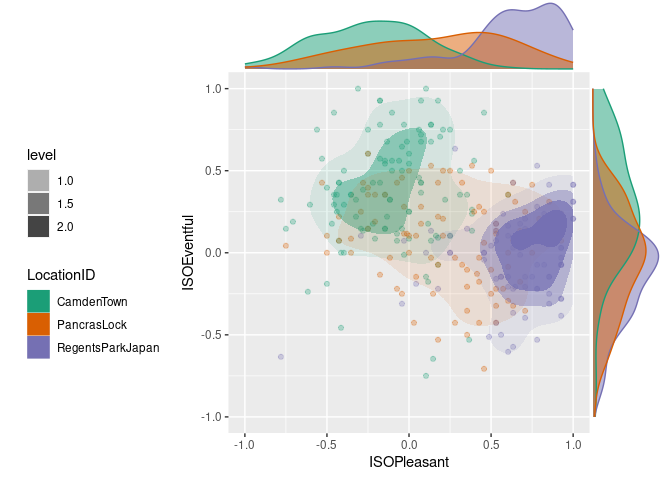

<!-- README.md is generated from README.Rmd. Please edit that file -->

# SoundscapeR

<!-- badges: start -->
<!-- badges: end -->

The goal of SoundscapeR is to enbale simple soundscape survey analysis
and visualisation in R.

## Installation

You can install the development version of SoundscapeR from
[GitHub](https://github.com/) with:

``` r
# install.packages("devtools")
devtools::install_github("MitchellAcoustics/SoundscapeR")
```

## Example

This is a basic example which shows you how to load the International
Soundscape Database from the internet:

``` r
library(soundscaper)
data <- loadISD()
head(data)
#> # A tibble: 6 × 78
#>   LocationID SessionID   GroupID RecordID Language Lockdown start_time end_time
#>   <chr>      <chr>       <chr>      <dbl> <chr>       <dbl>      <dbl>    <dbl>
#> 1 CamdenTown CamdenTown1 CT101        525 English         0     43587.   43587.
#> 2 CamdenTown CamdenTown1 CT101        561 English         0     43587.   43587.
#> 3 CamdenTown CamdenTown1 CT101        526 English         0     43587.   43587.
#> 4 CamdenTown CamdenTown1 CT102        560 English         0     43587.   43587.
#> 5 CamdenTown CamdenTown1 CT103        527 English         0     43587.   43587.
#> 6 CamdenTown CamdenTown1 CT104        528 English         0     43587.   43588.
#> # ℹ 70 more variables: latitude <dbl>, longitude <dbl>, Traffic <dbl>,
#> #   Other <dbl>, Human <dbl>, Natural <dbl>, ISOPleasant <dbl>,
#> #   ISOEventful <dbl>, pleasant <dbl>, chaotic <dbl>, vibrant <dbl>,
#> #   uneventful <dbl>, calm <dbl>, annoying <dbl>, eventful <dbl>,
#> #   monotonous <dbl>, Overall <dbl>, Appropriate <dbl>, loud <dbl>,
#> #   sss04 <dbl>, sss05 <dbl>, who01 <dbl>, who02 <dbl>, who03 <dbl>,
#> #   who04 <dbl>, who05 <dbl>, WHO_Sum <dbl>, Age <dbl>, Gender <chr>, …
```

What is special about using `README.Rmd` instead of just `README.md`?
You can include R chunks like so:

``` r
cut.data <- data %>%
  dplyr::filter(LocationID %in% c("CamdenTown", "PancrasLock", "RegentsParkJapan"))
ISOjointplot(cut.data, group = "LocationID")
#> Warning: Removed 167 rows containing non-finite values (`stat_density2d()`).
#> Removed 167 rows containing non-finite values (`stat_density2d()`).
#> Warning: Removed 167 rows containing missing values (`geom_point()`).
```



You’ll still need to render `README.Rmd` regularly, to keep `README.md`
up-to-date. `devtools::build_readme()` is handy for this.

You can also embed plots, for example:


In that case, don’t forget to commit and push the resulting figure
files, so they display on GitHub and CRAN.
